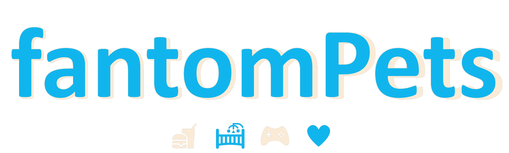
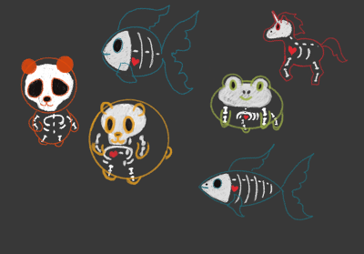
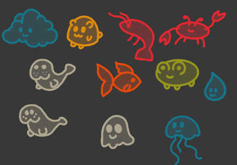
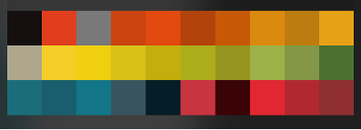

<p align="center" width="100%">
    
</p>

# Inspiration

The inspiration is to create an ultra-portable decentralized progressive web app in the form of a virtual pet game, built on the Fantom blockchain.

The goal is to design the UX for non-crypto users as much as possible. This is why we chose a virtual pet game. It is a familiar game type. We added a local wallet creation option as well as login with email/phone number.

We intentionally attempted to use game language and as little web3 jargon as possible throughout the application.

# What it does
## Why build a game on the Fantom Blockchain & IPFS?

We chose to build the game on the fantom blockchain and IPFS because of the ability to store a massive number of game assets. Enabling many users to play the game without having to host all the data for the game.

## How does it Leverage the Fantom Blockchain?

A thirdweb Fantom ERC1155 edition drop contract was created for game assets. This contract will allow for future pets to be added to the game without disruption to the game itself. No updates required. Once the page reloads, the new pet will appear. This minimizes the need for storage and asset management and essentially utilizes the blockchain as storage, a database, and a method for people to purchase their in-game pet.

Each pet has a finite supply except for the base pet, which has an unlimited supply.

In the future, we hope to use this feature to enable community members to contribute by creating fantomPets using the following metadata structure with animated PNGs.

```json
{
    "name": "fantom Bear v2",
    "description": "2023 fantomPets virtual pet game asset",
    "image": "ipfs://bafybeigipvt5die2axtfzfk5u3udmknlsbhbe4q3kc53zdudg53vbmymnu/Happy.png",
    "happy": "ipfs://bafybeigipvt5die2axtfzfk5u3udmknlsbhbe4q3kc53zdudg53vbmymnu/Happy.png",
    "happysquint": "ipfs://bafybeigipvt5die2axtfzfk5u3udmknlsbhbe4q3kc53zdudg53vbmymnu/HappySquint.png",
    "dead": "ipfs://bafybeigipvt5die2axtfzfk5u3udmknlsbhbe4q3kc53zdudg53vbmymnu/Dead.png",
    "eat": "ipfs://bafybeigipvt5die2axtfzfk5u3udmknlsbhbe4q3kc53zdudg53vbmymnu/Eat.png",
    "mad": "ipfs://bafybeigipvt5die2axtfzfk5u3udmknlsbhbe4q3kc53zdudg53vbmymnu/Mad.png",
    "sad": "ipfs://bafybeigipvt5die2axtfzfk5u3udmknlsbhbe4q3kc53zdudg53vbmymnu/Sad.png",
    "semisad": "ipfs://bafybeigipvt5die2axtfzfk5u3udmknlsbhbe4q3kc53zdudg53vbmymnu/SemiSad.png",
    "sleep": "ipfs://bafybeigipvt5die2axtfzfk5u3udmknlsbhbe4q3kc53zdudg53vbmymnu/Sleep.png",
    "attributes": [
        {
            "trait_type": "fantomPet",
            "value": "Bear"
        },
        {
            "trait_type": "Color",
            "value": "Purple"
        }
    ]
}
```

Additionally, artists can collect royalties on their contributed fantomPets as those familiar with the blockchain will buy/trade/sell their pets.

Also, a pet shop can be created to simplify this process for those who play the game.

## Decentralized Storage

The game progress is saved with [NFT.Storage](https://nft.storage/) and local storage. If the user saves the game, leaves the page, and then returns, the game progress is fetched using the CID stored in local storage and fetches the game progress from IPFS. If the user saves the game and downloads the pet, the downloaded JSON file contains the appropriate naming convention and CID to fetch the game progress from IPFS.

I found that the NFT storage tool works exceptionally well and fast. The current rate limitation is 200/s, but a feature can easily be added for users to insert their own API key from NFT storage for limited risk of a saving error.

## Open Source

We have open-sourced the game so that anyone can contribute to the future of the game ecosystem. We plan to create opportunities for other artists to contribute in the future.

## The Artwork by Curly Fries

A major source of inspiration behind the fantomPets design is the original Tamagotchi pet game. I received a Tamagotchi as a gift from my grandma in the 90s when I was in middle school. I remember carrying it around with me everywhere I went so I could care for it. I was never good at video games but very much enjoyed taking care of my sweet little pixelated pet. We want those with fantomPets to have a similar experience with caring for their pets with updated animations, colors, and interactions.

<p align="center" width="100%">
    
    
</p>

We as a team brainstormed early on the idea of fantom pets also acting as phantom pets. The original idea was to have a visible skeletal structure, but images looked better on a smaller scale without small details within the design. I remained with the fantom/phantom theme by creating a transparent fill layer for each character.

The color palette used consists of rich retro-inspired colors. It was chosen early on in the project, so the colors inspired the pet designs. From there, I narrowed the selection down to pet designs that could have fun and interesting animations.

<p align="center" width="100%">
    
</p>

I wanted each expression to be cute and easily recognized as you interact with your pet. You can easily tell when it is happy, sad, etc.

<p align="center" width="100%">
    
    
</p>

- Dimensions: 1080x1080 pixels
- Created in Procreate
- Exported as animation PNG files

## How we built it?

### Framework:
The application was built with a nextjs, react, typescript starter template from thirdweb.

```bash
npx thirdweb create --template next-typescript-starter
```

### Tools:
The tools we used to build this application are thirdweb’s SDK, thirdweb’s ERC1155 Drop Edition v4.0.8, NFT storage API, Magic Link, ChatGPT for code assistance, deployed on Vercel, and Procreate for artwork.

- [thirdweb](https://thirdweb.com/)
- [thirdweb's SDK](https://portal.thirdweb.com/wallet/magic)
- [thirdweb’s ERC1155 Drop Edition v4.0.8](https://thirdweb.com/thirdweb.eth/DropERC1155/4.0.8)
- [NFT storage API](https://nft.storage/docs/how-to/mint-erc-1155/)
- [ChatGPT](https://chat.openai.com/)

### Brainstorming and Evolution:
We watched a number of virtual pet game videos and did a number of image searches to observe the common elements in a virtual pet game.

The game took a life of its own as we created it. With every stroke on the iPad and new line of code we generated new ideas and concepts until we landed at what you see today.

It was a super fun creative process, and we learned so much!

## Challenges we ran into

I expected the blockchain aspects to be the most challenging, but surprisingly it was the mini-game that I spent many hours trying to optimize. I rewrote the mini-game about 4-10 times and spent many hours getting help from ChatGPT! The problem is with the collisions between the fantomPet and the orbs. The goal of the game is for the pet to collect the orbs. Currently, the orbs are inconsistently collected. It seems that the speed at which the collisions are detected is not fast enough. I attempted using a basic collision algorithm, quad tree, a dispatcher, for loops for faster rendering speeds, and in the end, none of them worked. The activity game needs some improvements. Initially, the game seemed simple enough to not require something like three.js, but I was wrong. I recently found a library on GitHub for TypeScript to detect collisions. After the judging period, I plan to update the game with this library.

- [detect-collisions library](https://github.com/Prozi/detect-collisions/tree/master)

## Accomplishments that we're proud of

- Linking IPFS for game storage and portability.
- Leveraging NFTs to create animated game assets that work for a PWA.
- Leveraging animated PNGs as in-game assets.
- PWA dApp.

## What we learned

- Curly Fries learned how to create transparent animations with PNGs.
- CalculatingZero learned how to render transparent PNGs with thirdweb’s mediarenderer as in-game assets.
- CalculatingZero learned how to create a metadata structure that would allow for animation renders for various emotional states.
- CalculatingZero learned how to manage saving data leveraging local storage in conjunction with IPFS to create a great user experience and ultra-portability.
- CalculatingZero now has extensive knowledge of thirdweb’s tool sets.
- CalculatingZero significantly extended knowledge of React, TypeScript, and various React libraries to build this application.
- CalculatingZero learned how to create a complete mobile in-app experience with a local wallet.

## What's next for fantomPets

- Create a community event for people to submit new pets to the collection.
- Update the mini-game with optimal collision detection.
- Deploy a smart wallet contract:
- This will allow us to completely remove the need for a user to know how to interact with web3 dapps.

# Appendix

This was a great tool to streamline the development process on the Fantom blockchain.

## Getting Started

Create a project using this example:

```bash
npx thirdweb create --template next-typescript-starter
```

You can start editing the page by modifying `pages/index.tsx`. The page auto-updates as you edit the file.

On `pages/_app.tsx`, you'll find our `ThirdwebProvider` wrapping your app, this is necessary for our [hooks](https://portal.thirdweb.com/react) and
[UI Components](https://portal.thirdweb.com/ui-components) to work.

### Deploy to IPFS

Deploy a copy of your application to IPFS using the following command:

```bash
yarn deploy
```

## Learn More

To learn more about thirdweb and Next.js, take a look at the following resources:

- [thirdweb React Documentation](https://docs.thirdweb.com/react) - learn about our React SDK.
- [thirdweb TypeScript Documentation](https://docs.thirdweb.com/typescript) - learn about our JavaScript/TypeScript SDK.
- [thirdweb Portal](https://docs.thirdweb.com) - check our guides and development resources.
- [Next.js Documentation](https://nextjs.org/docs) - learn about Next.js features and API.

You can check out [the thirdweb GitHub organization](https://github.com/thirdweb-dev) - your feedback and contributions are welcome!

## Thirdweb's Discord

For any questions, suggestions, join thirdweb's discord at [https://discord.gg/thirdweb](https://discord.gg/thirdweb).
